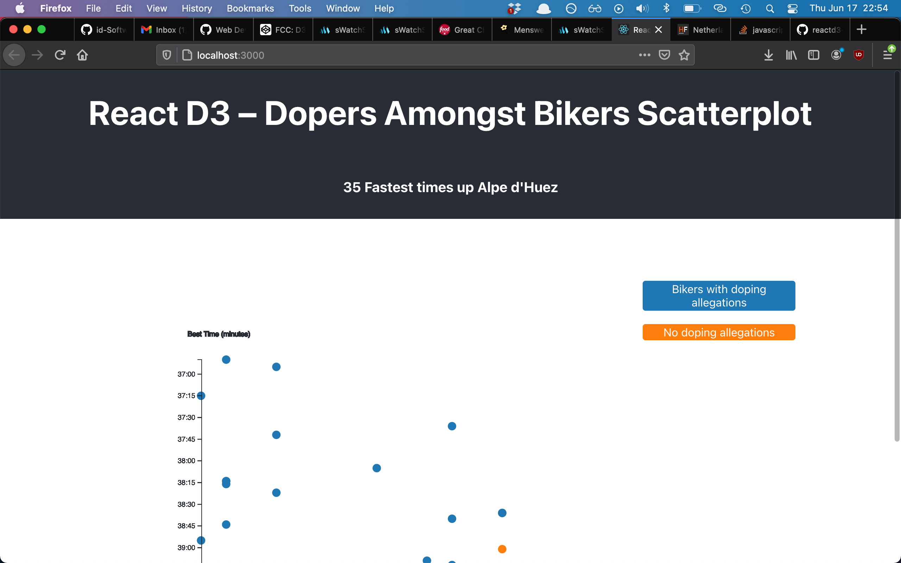

# React D3 Dopers Amongst Bikers Scatterplot

Scatterplot exercise by [FCC](https://www.freecodecamp.org/learn/data-visualization/data-visualization-projects/visualize-data-with-a-scatterplot-graph) using D3 and react inspired by this [solution](https://codepen.io/freeCodeCamp/pen/bgpXyK)

## How it looks

## How it runs

Run `npm install` or `yarn` followed by `npm start` or `yarn start`.